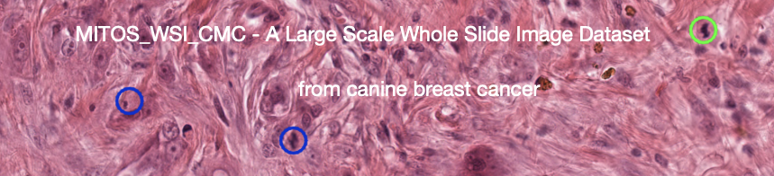

## MITOS_WSI_CMC data set

This repository contains all code needed to derive the Technical Validation of our paper:
> Aubreville, M., Bertram, C.A., Donovan, T.A. et al. A completely annotated whole slide image dataset of canine breast cancer to aid human breast cancer research. Sci Data 7, 417 (2020). https://doi.org/10.1038/s41597-020-00756-z

For an introduction into the work, please see the following video:

## Erratum (corrected)

In the dataset paper, the file fa4959e484beec77543b.svs was listed as part of the training set, and the file 4eee7b944ad5e46c60ce.svs to be part of the test set. This is also how the networks were trained. However, since our process involved putting all WSI (not only the test WSI) through the model during inference (to optimize the threshold on the training data), we split the data after the inference run once again (separate_sets.py). During this step, we had a small glitch in the assignment of files that was not noticed prior to publication and was thankfully pointed out by the github user schwanabc. This error led to a train/test bleed of a single slide. Instead of the file 4eee7b944ad5e46c60ce.svs, the file fa4959e484beec77543b.svs was assigned to the test set in the evaluation, which was, of course, unintended. 

Correcting for this error leads to slightly deteriorated results for some conditions. In general, the derived conclusions (in our paper) still hold true. This is an overview of the changed results (as found in this repository). 

We apologize for the error.

## Overview

The dataset contains two main parts:

### Data set variant evaluation

This folder contains the evaluation for all variants, i.e. the manually labelled (MEL), the the object-detection augmented manually expert labelled (ODAEL), and the clustering- and object detection augmented manually expert labelled (CODAEL) variant.

Main results of the data set variants based on a one- and two-stage-detector can be found in [Evaluation.ipynb](Evaluation.ipynb).

## Setting up the environment

Besides [https://github.com/fastai/](fast.ai) you can use the following notebook to set up the dataset for you: [Setup.ipynb](Setup.ipynb). The download of the WSI from figshare will take a while. Once everything has been downloaded, you can either use the data loaders provided in this repository, or, if you want to get a visual impression of the dataset, use [our annotation tool SlideRunner](https://github.com/maubreville/SlideRunner). The SlideRunner package (which can be acquired using pip) is also a pre-requisite to run the code.

## Training notebooks

The training process can be seen in the notebooks for the respective dataset variants:

[RetinaNet-CMC-MEL.ipynb](RetinaNet-CMC-MEL.ipynb)

[RetinaNet-CMC-ODAEL.ipynb](RetinaNet-CMC-ODAEL.ipynb)

[RetinaNet-CMC-CODAEL.ipynb](RetinaNet-CMC-CODAEL.ipynb)

## Pre-trained models

You can fetch the first run (out of five) that we did for the Sci Data paper here:

[https://imi.thi.de/research/models/CMC/RetinaNet-CMC-CODAEL-512sh-repetition1.pkl.bz2](RetinaNet-CMC-CODAEL-512sh-repetition1.pkl.bz2)

